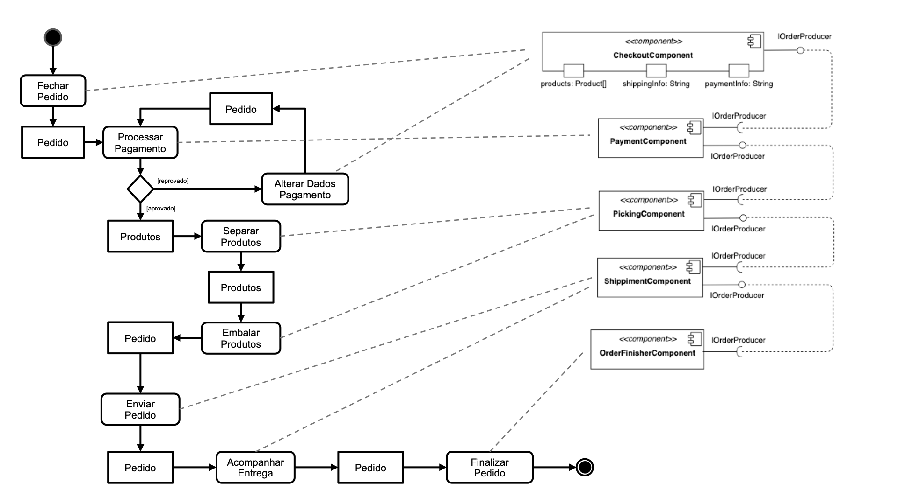
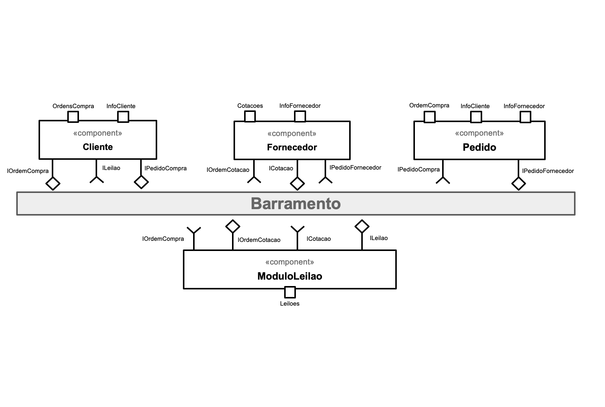
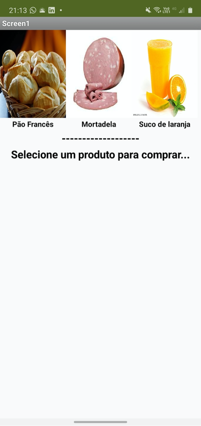
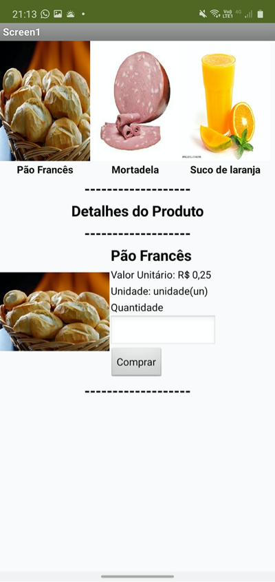
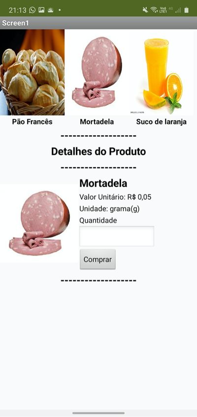
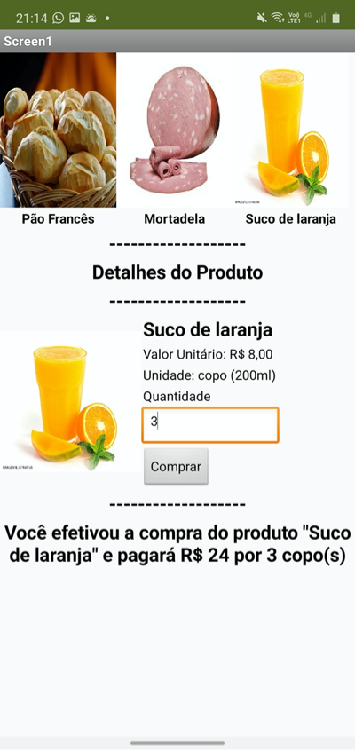
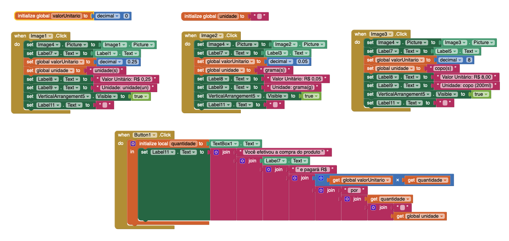

# Lab03 - Model-View-Controller

---

## Tarefa 1

Considere a `Tarefa Projeto de Composição de Componentes para Pedido`, que foi realizada no [Laboratório 1](../lab01):

> Elabore um diagrama de composição de componentes que execute o fluxo de execução que vai desde o pedido de um produto até a sua entrega para o cliente.

Represente esse processo na forma de um diagrama de atividades e ligue etapas desse diagrama com os componentes (do seu diagrama original) que executam as ações (Actions). Nesse processo, você pode enriquecer o fluxo da atividade, já que o diagrama te oferece primitivas de decisão e paralelização, bem como modificar os componentes que você projetou originalmente.

### Diagrama de Atividades

---

## Tarefa 2

Usando a representação de componentes que se comunicam por mensagens na forma de uma orquestração, elabore um diagrama contendo os componentes (Blackbox) e as respectivas interfaces de eventos para realizar um **leilão virtual invertido de produtos**, conforme a seguinte sequência:

1. O cliente seleciona um produto;
2. Um módulo de leilão informa a todos os potenciais fornecedores daquele produto sobre a demanda e inicia um leilão;
3. Os potenciais fornecedores fazem ofertas;
4. Os três produtos com menor preço são apresentados para o cliente - em caso de empate de preço, considerar quem fez primeiro a oferta.

### Diagrama de Componentes

### Sequência de Atividades

1. O componente `Cliente` seleciona um produto e posta uma mensagem com o tópico `IOrdemCompra`;  
2. O componente `ModuloLeilao` que assina o tópico `IOrdemCompra` recebe a ordem e posta uma mensagem com o tópico `IOrdemCotacao` para cada produto;  
3. Os componentes do tipo `Fornecedor` que assinam o tópico `IOrdemCotacao` recebem as ordens e postam uma mensagem com o tópico `ICotacao` contendo `InfoFornecedor` e `ValorProduto` para cada ordem de cotação recebida;
4. O componente `ModuloLeilao` que assina o tópico `ICotacao` alimenta o `Leilao` com as informações de ofertas e ao final das resposta posta uma mensagem com o tópico `ILeilao` com as informações do `Leilao` concluído;
5. O componente `Cliente` que assina o tópico `ILeilao` recebe as informações de `Leilao` concluído, seleciona as melhores ofertas e posta uma mensagem com o tópico `IPedidoCompra`.
6. O componente `Pedido` que assina o tópico `IPedidoCompra` recebe o pedido de compra e desmembra em pedidos direcionados aos fornecedores vencedores de cada produto postando uma mensagem com o tópico `IPedidoFornecedor`.
7. Os componentes do tipo `Fornecedor` que assinam o tópico `IPedidoFornecedor` recebem e processam os pedidos em que foram vencedores.

---

## Tarefa 3

Elabore um protótipo de uma interface gráfica com um usuário no MIT App Inventor que simule uma interface de compra, com as seguintes funcionalidades:

1. apresente uma interface com as seguintes áreas:  

    * uma lista opções com o nome de três produtos (a sua escolha);
    * um quadro de detalhes do produto;
    * um campo para o usuário digitar a quantidade que deseja comprar;
    * um botão de efetivação da compra;
    * um campo de mensagens no rodapé.

2. ao clicar no produto da lista de opções, deve ser apresentado no quadro de detalhamento:

    * a imagem do produto;
    * seu nome;
    * o valor unitário e a unidade (g, kg, l);

3. quando o botão de efetivação da compra for clicado, deve ser mostrado no campo de mensagem (rodapé) os dados da compra sendo efetivada: nome do produto, quantidade e o valor total a ser pago.

### Arquivo do Projeto

- [app/INF331_Lab03.aia](app/INF331_Lab03.aia)

### Tela 1 - Nenhum produto selecionado

### Tela 2 - Primeiro produto selecionado

### Tela 3 - Segundo produto selecionado

### Tela 4 - Compra de um dos produtos efetivada

### Tela 5 - Diagrama de blocos do aplicativo

---

## Tarefa 4

Tarefa a ser feita com a equipe do trabalho:
Usando o espaço que separa o MVC, detalhe os diagramas das Tarefas 1 e 2, da seguinte maneira:

* considere que os diagramas que você fez fazem parte do Controller;
* detalhe mais componentes referentes ao Model e ao View;
* defina como será a interação entre esses componentes.

### Repositório da Equipe

- [eNove/unicamp-engsoft-2020-inf331/lab03 @ Github](https://github.com/eNove/unicamp-engsoft-2020-inf331/tree/master/lab03)

---

## Referências

No link do Google Drive [modelo](https://docs.google.com/presentation/d/1UMC749wjVD1aRUSH1OuiT006SkXqYUjedhL8fZJd6xY/edit?usp=sharing) ou no diretório [resources/ @ santanche/component2learn](https://github.com/santanche/component2learn/blob/master/labs/03-mvc/resources) você encontrará um modelo para resolver as tarefas 1 e 2.