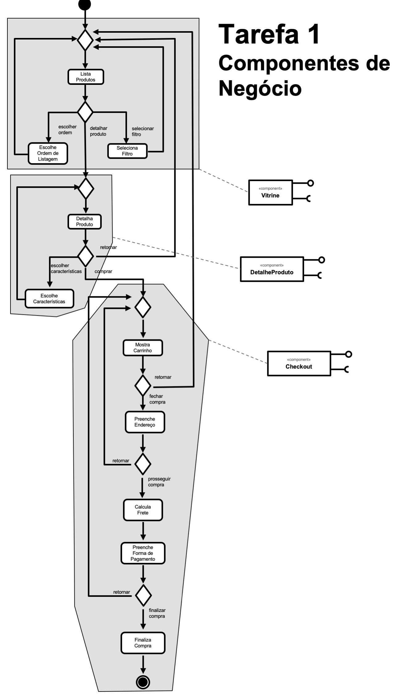
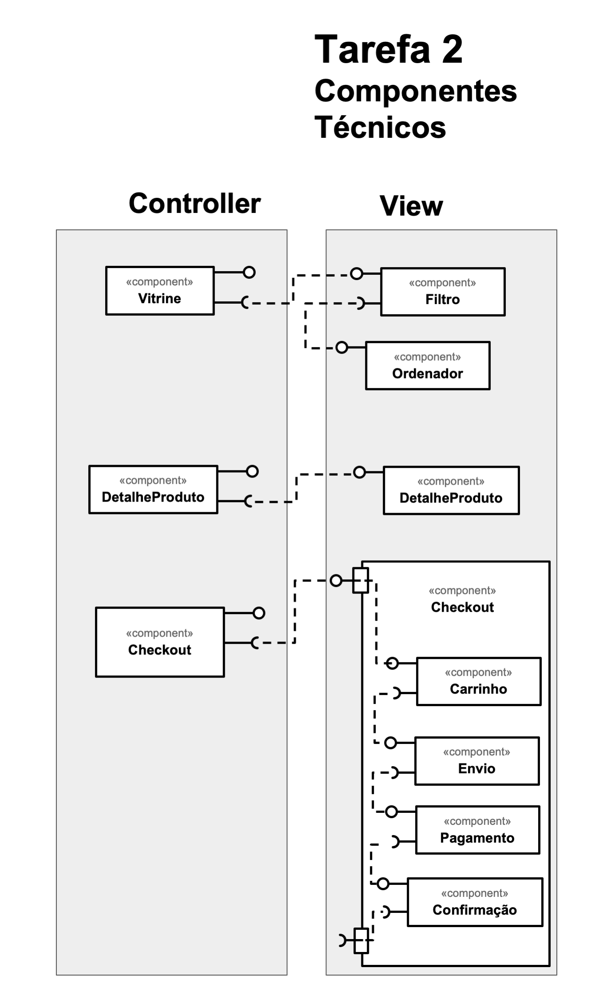

# Lab04 - Serviços

---

## Tarefa 1

Componentes de Negócio

Delimite partes do diagrama à esquerda que você avalia que deveriam estar dentro de um componente.

### Diagrama

---

## Tarefa 2

Componentes Técnicos

Separe os componentes do View daqueles definidos no Controller.

### Diagrama

---

## Tarefa 3

Componentes Técnicos

Separe os componentes do Model daqueles definidos no Controller.

### Diagrama

---

## Tarefa 4

Encontre dois serviços REST interessantes, que recebam no mínimo dois parâmetros e execute pelo menos uma consulta em cada um deles. Apresente para cada serviço que você escolheu:

- Título do serviço
- A URI do serviço
- Uma breve descrição do mesmo
- O cabeçalho HTTP da requisição
- O cabeçalho e conteúdo JSON, XML ou outro formato da resposta

### Serviço `1`

* **Título do serviço**: `Covid19 Brazl API`
* **Breve descrição**:
  > API que notifica casos de doença pelo coronavírus 2019 (COVID-19) no Brasil e mundo.  
  > Mais informações podem ser vista em seu repositório do Github: [covid19-brazil-api @ Github](https://github.com/devarthurribeiro/covid19-brazil-api)
* **Comando da execução**:
    ~~~bash
    export PAIS=brazil
    export UF=sp
    curl --request GET \
        --url "https://covid19-brazil-api.now.sh/api/report/v1/${PAIS}/uf/${UF}"
    ~~~
* **URL completa da requisição**: `https://covid19-brazil-api.now.sh/api/report/v1/brazil/uf/sp`
* **Cabeçalho HTTP da chamada**:
    ~~~http
    GET /api/report/v1/brazil/uf/sp HTTP/2
    Host: covid19-brazil-api.now.sh
    User-Agent: curl/7.64.1
    Accept: */*
    ~~~
* **Cabeçalho HTTP da resposta**:
    ~~~http
    HTTP/2 200 
    content-type: application/json; charset=utf-8
    access-control-allow-credentials: true
    date: Sat, 29 Aug 2020 00:34:29 GMT
    access-control-allow-origin: *
    cache-control: public, max-age=0, must-revalidate
    content-length: 139
    x-vercel-cache: MISS
    age: 0
    server: Vercel
    x-vercel-id: gru1::sfo1::jlt8r-1598661269304-602a06d5c8b0
    strict-transport-security: max-age=63072000; includeSubDomains; preload
    ~~~
* **Conteúdo da resposta**:
    ~~~json
    {
        "uid": 35,
        "uf": "SP",
        "state": "São Paulo",
        "cases": 796209,
        "deaths": 29694,
        "suspects": 5334,
        "refuses": 596,
        "datetime": "2020-08-28T22:34:16.793Z"
    }
    ~~~

### Serviço `2`

* **Título do serviço**: `Dados Agregados do IBGE`
* **Breve descrição**:
  > API que disponibiliza os dados agregados do IBGE, como os do IPCA.  
  > Mais informações podem ser vista no site: [API e documentação](https://servicodados.ibge.gov.br/api/docs/agregados?versao=3)  
  >
  > Para a geração dos valores de forma facilitada é disponibilizado um [Query Builder](https://servicodados.ibge.gov.br/api/docs/agregados?versao=3#api-bq).
  > 
  > **Tabela dos códigos utilizados**:
  >  
  > |Categoria| Código| Descrição
  > |---| ---| ---
  > |Agregado| 6691| IPCA - Série histórica com número-índice, variação mensal e variações acumuladas a partir de 12 meses (a partir de novembro/2014)
  > |Variáveis| 9798| Variação acumulada
  > |Períodos| 202007| julho de 2020
  > |Nível Geográfico| N1| Brasil
  > |Localidades| 1| Brasil
  >  

* **Comando da execução**:
    ~~~bash
    export AGREGADO=6691
    export VARIAVEIS=9798
    export PERIODOS=202007
    export LOCALIDADES=N1[all]
    curl --request GET \
        --url "https://servicodados.ibge.gov.br/api/v3/agregados/${AGREGADO}/periodos/${PERIODOS}/variaveis/${VARIAVEIS}?localidades=${LOCALIDADES}"
    ~~~
* **URL completa da requisição**: `https://servicodados.ibge.gov.br/api/v3/agregados/6691/periodos/202007/variaveis/9798?localidades=N1[all]`
* **Cabeçalho HTTP da chamada**:
    ~~~http
    GET /api/v3/agregados/6691/periodos/202007/variaveis/9798?localidades=N1[all] HTTP/1.1
    Host: servicodados.ibge.gov.br
    User-Agent: curl/7.64.1
    Accept: */*
    ~~~
* **Cabeçalho HTTP da resposta**:
    ~~~http
    HTTP/1.1 200 OK
    Date: Sat, 29 Aug 2020 01:17:10 GMT
    Server: Apache/2.4.6 (CentOS) OpenSSL/1.0.2k-fips mod_qos/11.5
    Content-Length: 216
    Cache-Control: max-age=2707.068
    Expires: Sat, 29 Aug 2020 02:00:00 GMT
    Access-Control-Allow-Methods: GET
    Access-Control-Allow-Origin: *
    Age: 139
    Connection: close
    Content-Type: application/json
    ~~~
* **Conteúdo da resposta**:
    ~~~json
    [{
        "id": "9798",
        "variavel": "Variação acumulada",
        "unidade": "%",
        "resultados": [{
            "classificacoes": [],
            "series": [{
                "localidade": {
                    "id": "1",
                    "nivel": {
                        "id": "N1",
                        "nome": "Brasil"
                    },
                    "nome": "Brasil"
                },
                "serie": {
                    "202007": "23.23"
                }
            }]
        }]
    }]
    ~~~

---

## Referências

No link do Google Drive [modelo](https://docs.google.com/presentation/d/1ujoME3qoriVm7hHiC8uK2qWQ3mmHA81Qxe8n80vZYms/edit?usp=sharing) ou no diretório [resources/ @ santanche/component2learn](https://github.com/santanche/component2learn/blob/master/labs/04-servicos/resources) você encontrará um modelo para resolver as tarefas 1, 2 e 3.