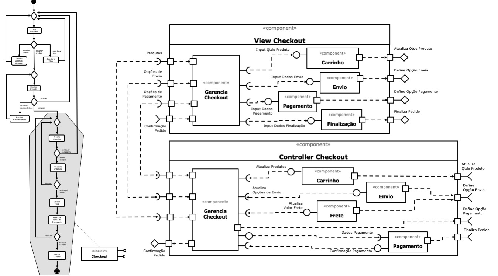

# Lab05 - Web como Plataforma e Subcomponentes

---

## Tarefa 1

Escolha um conjunto de componentes do laboratório passado e os represente na forma de componentes com sub-comopnentes.

### Diagrama de Subcomponentes

---

## Tarefa 2

Crie uma conta no [Codepen](https://codepen.io/), copie o código do exemplo [React 03 - Componente Barra](https://codepen.io/santanche/pen/KKzmbwR) para a sua conta e construa um exemplo de componente adaptando o exemplo apresentado. Por se tratar de programação em JavaScript, podem ser feitas adaptações bastante simples.

### Link para o projeto no Codepen

* [Unicamp - EngSoft 2020 - INF331 - Lab05](https://codepen.io/fernandomorais/pen/bGpYJrV)

### Código do componente

* **HTML**
    ~~~html
    

    ~~~

* **JavaScript**
    ~~~javascript
    class Slider extends React.Component {
        render() {
            const { value, onChange } = this.props;
            return (
                

                    <input type="range" min="0" max="100" value={value} onChange={onChange} />
                

            );
        }  
    }

    class Main extends React.Component {
        constructor(props){
            super(props);
            this.state = { current: 50 };
        }
    
        changeRange(e) {
            if(e == null || e.target == null) { return; }
            
            const { value } = e.target;
            
            this.setState({
                current: value
            });
        }
    
        render() {
            const { current } = this.state
            return (
                

                    <Slider value={current} onChange={this.changeRange.bind(this)} /> 
                    

                        O valor atual é {current}.
                    

                

            );
        }
    }

    ReactDOM.render(<Main />, 
        document.getElementById("root"));
    ~~~

---

## Referências

No link do Google Drive [modelo](https://docs.google.com/presentation/d/1M3eM98yVZDYqfIaVog8pRs8b7ckVjEwDBPQ-lJ_V18U/edit?usp=sharing) ou no diretório [resources/ @ santanche/component2learn](https://github.com/santanche/component2learn/blob/master/labs/04-servicos/resources) você encontrará um modelo para resolver as tarefas.